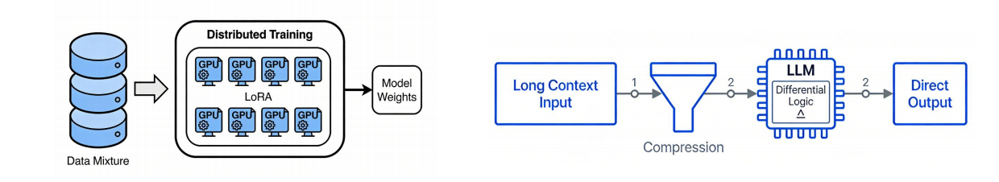
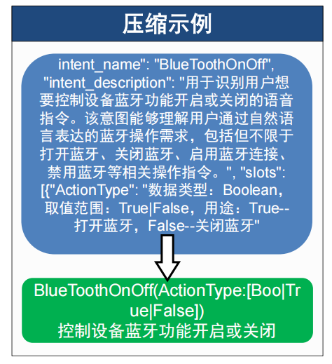
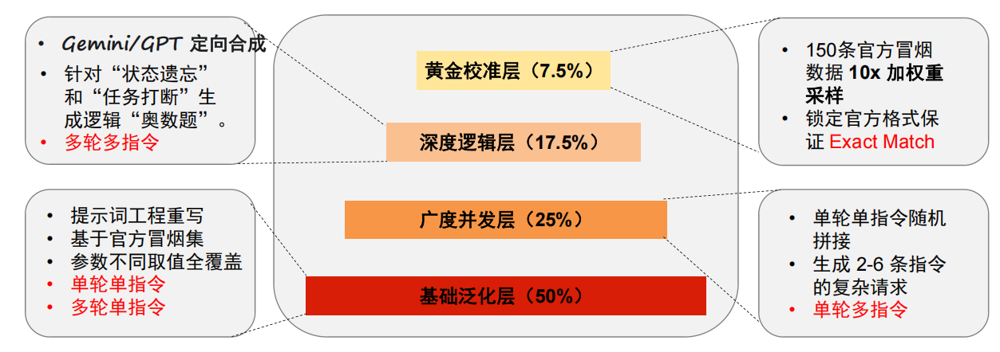
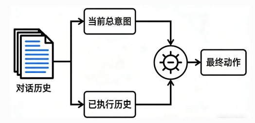
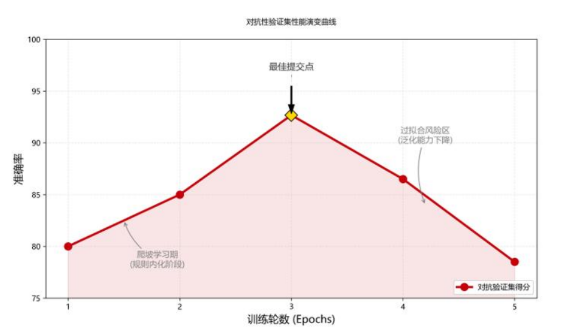

# 🏆 Lumina-Agent: Data-Centric & Memory-Aware End-to-End Voice Command System

> **Huawei Cloud "Cloud Pioneer" AI Challenge - Final Champion Solution (Rank 1)**

[](https://opensource.org/licenses/Apache-2.0)
[](https://huggingface.co/Qwen)
[](https://competition.huaweicloud.com/)

**Team: 拾晓泽 (Shi Xiao Ze)**

---

## 📖 Introduction

**Lumina-Agent** is the winning solution for the Huawei Cloud HarmonyOS System Control Agent Competition.

Facing strict constraints—**5GB NPU memory**, **inference latency scoring**, and **complex multi-turn logic**—we bypassed complex RAG or Hierarchical architectures. Instead, we proposed a **Minimalist, Data-Centric, and NPU-Optimized** end-to-end architecture.

By leveraging **Semantic Prompt Compression**, **State Differential Reasoning**, and a **Mixture-of-Experts Data Pipeline**, we achieved **100% accuracy** on the local smoke test set and ranked **No.1** in the finals using only a **1.7B parameter model**.

📄 **[View Final Presentation Slides (PDF)](docs/Lumina-Agent_Final_Presentation.pdf)**

---

## 🚀 Key Innovations

### 1. 🧠 Architecture: Flat-Direct over Hierarchical

We abandoned the popular Hierarchical Architecture to avoid double inference latency and error cascading.

* **Decision**: Use **Direct Agent** for one-pass inference.
* **Benefit**: Maximized global attention visibility and minimized latency.



### 2. ⚡ System Optimization: Memory-Aware Compression

To fit 100+ tools into the 5GB NPU memory limit while maintaining speed:

* **Semantic Distillation**: Extracted "Verb + Object" cores from tool descriptions.
* **Parameter Pruning**: Truncated enum examples to Top-2.
* **Result**: Context length compressed from **20,000 -> 5,000** tokens. Inference speed up **40%**.



### 3. 🏗️ Training: Long-Context on Consumer GPUs

Training a 6k context model on 24GB VRAM (RTX 3090) without Flash Attention:

* **Gradient Checkpointing**: Reduced activation memory by 60%.
* **LoRA (All-Linear)**: Finetuned all linear layers (not just Q/V) to enhance logic capabilities while freezing the backbone to prevent catastrophic forgetting.
* **Native BF16**: Full pipeline bfloat16 to match NPU precision.

### 4. 📊 Data Engineering: MoE Synthesis Pipeline

We constructed a 20,000+ sample dataset using a layered strategy:

* **Golden Layer**: 10x resampling of official data for format alignment.
* **Logic Layer**: GPT-4 generated multi-turn logic (State Tracking).
* **Concurrency Layer**: Rule-based synthesis for multi-instruction scenarios.
* **Cleaning**: Anti-hallucination rules (e.g., relative time normalization).



### 5. 🧮 Algorithm: State Differential Reasoning

To solve the "repetition" issue in multi-turn dialogues, we designed an In-Context Logic Flow:

$$
Output_t = (Intent_{new} + Slot_{fill}) - State_{completed}
$$



---

## 📈 Experiments

Our strategy validated a "Inverted-U" curve for generalization. Epoch 3 proved to be the sweet spot for LoRA fine-tuning.

* **Final Rank**: 1/X
* **Local Accuracy**: 100% (Smoke Test)
* **Complex Logic Acc**: >90%



---

## 🛠️ Quick Start

### Prerequisites

* **Python**: >= 3.10
* **PyTorch**: >= 2.1.0
* **Transformers**: >= 4.45.0

### Installation

1. **Clone the repository**

   ```bash
   git clone https://github.com/LYZ0306/Lumina-Agent.git
   cd Lumina-Agent
   ```
2. **Create a Conda environment**

   ```bash
   conda create -n lumina python=3.10 -y
   conda activate lumina
   ```
3. **Install PyTorch (CUDA Version)**
   *Note: Please install the correct version matching your CUDA driver.*

   ```bash
   # For CUDA 12.1 (Recommended)
   pip install torch --index-url https://download.pytorch.org/whl/cu121
   ```
4. **Install other dependencies**

   ```bash
   pip install -r requirements.txt
   ```

### Model Preparation

Before running the agent, you need to download the base model ( **Qwen3-1.7B**) and place it in the `models/` directory.

### Inference Demo

```python
from src.agent import CustomAgent

# 1. Initialize Agent
# (It will load base model and LoRA weights automatically if 'lora_weights/' exists)
agent = CustomAgent()

# 2. Prepare conversation history
history = [
    {"role": "user", "content": "帮我把蓝牙打开一下，谢谢。"}
]

# 3. Run Inference
response = agent.run(history)

# Expected Output: <tool>BlueToothOnOff(ActionType=True)</tool>
```

---

## 👥 Team

**拾晓泽 (Shi Xiao Ze)**

* **Lv Yuze**: Architecture Design & Algorithm Optimization
* **Shi Yixi（[shiyixi758-rgb](https://github.com/shiyixi758-rgb)）**: Data Engineering & Anti-Hallucination
* **Liu Xiaorui（[Yonom1 (Xiaorui Liu)](https://github.com/Yonom1)）**: System Deployment & Memory Optimization

## 📄 License

This project is licensed under the Apache 2.0 License.
